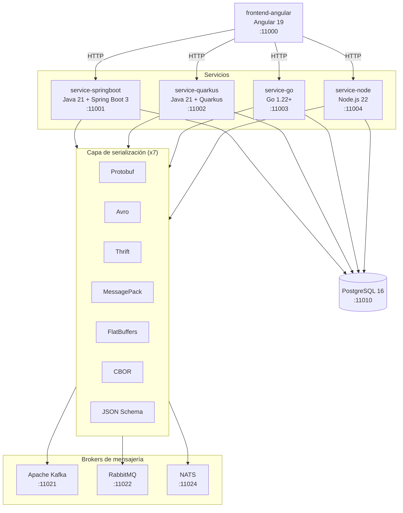
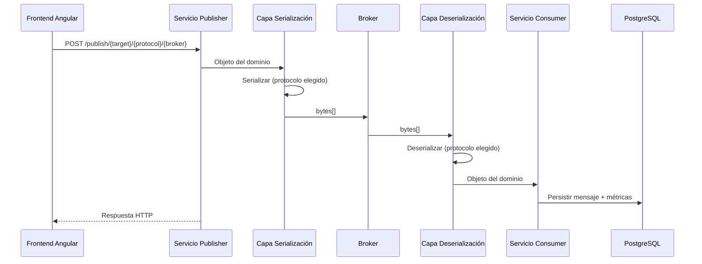
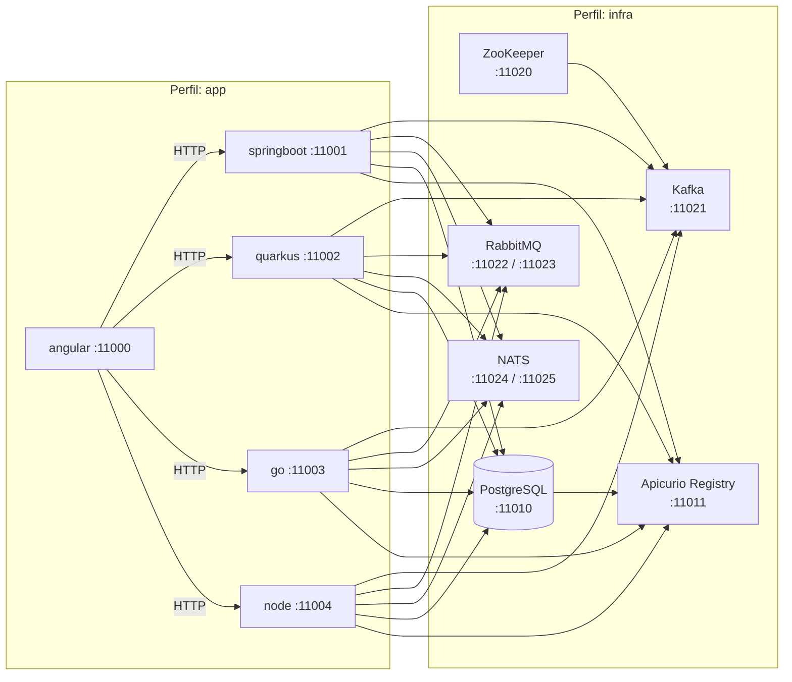
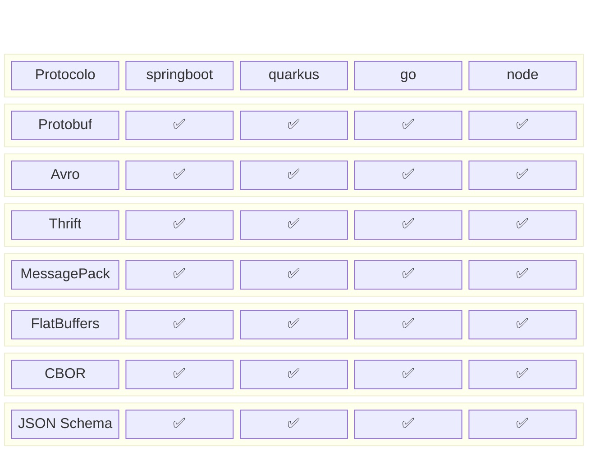

# serialplab

Proof of Concept (PoC) que evalúa la intercomunicación entre servicios heterogéneos utilizando múltiples formatos de serialización y sistemas de mensajería.

**4 servicios** × **7 protocolos** × **3 brokers** = **84 combinaciones**

## Arquitectura de alto nivel



## Flujo de mensajes



## Infraestructura Docker



## Frontend

| Aplicación | Stack | Puerto | Spec |
|---|---|---|---|
| `frontend-angular` | Angular 19 + TypeScript | 11000 | [spec](specs/frontend/frontend-angular.md) |

## Servicios

| Servicio | Stack | Puerto | Spec |
|---|---|---|---|
| `service-springboot` | Java 21 + Spring Boot 3 | 11001 | [spec](specs/services/service-springboot.md) |
| `service-quarkus` | Java 21 + Quarkus | 11002 | [spec](specs/services/service-quarkus.md) |
| `service-go` | Go 1.22+ | 11003 | [spec](specs/services/service-go.md) |
| `service-node` | Node.js 22 + Express/Fastify | 11004 | [spec](specs/services/service-node.md) |

## Protocolos de serialización

| Protocolo | Formato | Schema | Spec |
|---|---|---|---|
| Protocol Buffers | Binario | `.proto` | [spec](specs/protocols/protobuf.md) |
| Apache Avro | Binario | `.avsc` | [spec](specs/protocols/avro.md) |
| Apache Thrift | Binario | `.thrift` | [spec](specs/protocols/thrift.md) |
| MessagePack | Binario | No | [spec](specs/protocols/messagepack.md) |
| FlatBuffers | Binario | `.fbs` | [spec](specs/protocols/flatbuffers.md) |
| CBOR | Binario | No | [spec](specs/protocols/cbor.md) |
| JSON Schema | Texto | JSON Schema | [spec](specs/protocols/json-schema.md) |

## Brokers de mensajería

| Broker | Protocolo nativo | Puertos | Spec |
|---|---|---|---|
| Apache Kafka | TCP binario | 11021 | [spec](specs/brokers/kafka.md) |
| RabbitMQ | AMQP 0-9-1 | 11022, 11023 | [spec](specs/brokers/rabbitmq.md) |
| NATS | TCP texto/binario | 11024, 11025 | [spec](specs/brokers/nats.md) |

## Matriz de compatibilidad



Todos los servicios soportan los 3 brokers (Kafka, RabbitMQ, NATS) → **4 × 7 × 3 = 84 combinaciones**.

## Estructura del proyecto

```
serialplab/
├── README.md                    ← este archivo
├── ARCHITECTURE.md              ← arquitectura detallada
├── doc/                         ← documentación técnica de referencia
│   ├── lenguajes/               ← Java, Go, Node.js/TypeScript
│   ├── frameworks/              ← Spring Boot, Quarkus, Express/Fastify
│   ├── frontend/                ← Angular
│   ├── serializacion/           ← Protobuf, Avro, Thrift, MessagePack, ...
│   ├── brokers/                 ← Kafka, RabbitMQ, NATS
│   ├── bases-de-datos/          ← PostgreSQL
│   ├── registros/               ← Apicurio Registry
│   ├── infraestructura/         ← Docker, ZooKeeper
│   └── especificaciones/        ← AsyncAPI
├── specs/                       ← specs de uso en serialplab
│   ├── services/                ← specs por servicio
│   ├── frontend/                ← specs del frontend
│   ├── protocols/               ← specs por protocolo
│   ├── brokers/                 ← specs por broker
│   └── registros/               ← specs de registros de schemas
├── schemas/                     ← definiciones de schemas compartidos
├── asyncapi/                    ← contratos AsyncAPI 3.0
├── frontend-angular/
├── service-springboot/
├── service-quarkus/
├── service-go/
├── service-node/
└── docker-compose.yml
```

## Quick start

```bash
# Levantar infraestructura
docker compose --profile infra up -d

# Levantar todos los servicios
docker compose --profile infra --profile app up -d

# Ver logs de un servicio
docker compose logs -f service-go

# Parar todo
docker compose down
```

## Documentación

- [ARCHITECTURE.md](ARCHITECTURE.md) — Arquitectura completa del proyecto
- [doc/](doc/) — Documentación técnica de referencia (qué es cada tecnología)
- [specs/](specs/) — Specs modulares de uso en serialplab (cómo se usa cada componente)
