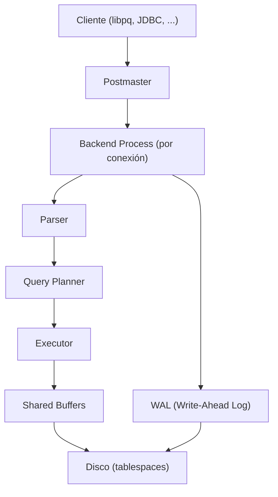

# PostgreSQL

## Qué es

Sistema de gestión de bases de datos relacional (RDBMS) open source, conocido por su robustez, extensibilidad y cumplimiento de estándares SQL. Originalmente desarrollado en UC Berkeley (proyecto Postgres, 1986), mantenido por el PostgreSQL Global Development Group.

- **Licencia:** PostgreSQL License (permisiva, similar a BSD/MIT)
- **Creador:** UC Berkeley / PostgreSQL Global Development Group
- **Puerto por defecto:** 5432

## Conceptos clave

- **ACID:** Atomicidad, Consistencia, Aislamiento y Durabilidad. PostgreSQL cumple completamente.
- **MVCC (Multi-Version Concurrency Control):** Permite múltiples transacciones concurrentes sin bloqueos de lectura.
- **Schemas:** Espacios de nombres dentro de una base de datos. Permiten aislamiento lógico entre aplicaciones.
- **Extensions:** Sistema de plugins (ej. `pg_stat_statements`, `PostGIS`, `pgcrypto`).
- **JSONB:** Tipo de dato binario JSON con indexación y consultas nativas.
- **CTEs (Common Table Expressions):** `WITH` clauses para queries complejas.
- **Window Functions:** Funciones analíticas sobre particiones de resultados.
- **Indexes:** B-tree (default), Hash, GiST, GIN, BRIN. Soporte para índices parciales y expresiones.
- **Logical Replication:** Replicación selectiva a nivel de tabla.
- **PL/pgSQL:** Lenguaje procedural nativo para funciones y triggers.

## Arquitectura



## Instalación / Docker

```bash
docker run -d --name postgres \
  -e POSTGRES_USER=serialplab \
  -e POSTGRES_PASSWORD=serialplab \
  -e POSTGRES_DB=serialplab \
  -p 5432:5432 \
  postgres:16

# Cliente CLI
psql -h localhost -U serialplab -d serialplab
```

## Uso en serialplab

PostgreSQL 16 es la base de datos central del proyecto. Cada servicio usa su propio schema para aislamiento:

| Schema | Servicio |
|---|---|
| `springboot` | service-springboot |
| `quarkus` | service-quarkus |
| `goservice` | service-go |
| `node` | service-node |

Se utiliza para persistir mensajes recibidos y resultados de benchmarks.

- Ver [ARCHITECTURE.md](../../ARCHITECTURE.md) sección "Base de datos"

## Referencias

- [PostgreSQL](https://www.postgresql.org/)
- [PostgreSQL Documentation](https://www.postgresql.org/docs/16/)
- [PostgreSQL Wiki](https://wiki.postgresql.org/)
