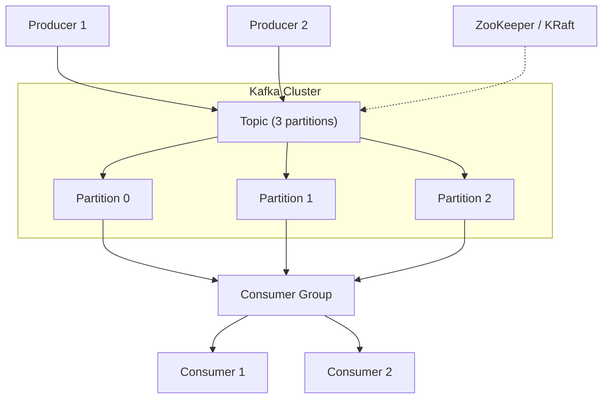

# Apache Kafka

## Qué es

Plataforma de streaming de eventos distribuida, capaz de manejar billones de eventos al día. Originalmente desarrollada por LinkedIn (Jay Kreps, Neha Narkhede, Jun Rao) en 2011 y donada a Apache Software Foundation.

- **Licencia:** Apache 2.0
- **Creador:** LinkedIn / Apache Software Foundation
- **Protocolo:** TCP binario propietario
- **Puerto en serialplab:** 11021

## Conceptos clave

- **Topic:** Canal lógico de mensajes. Los producers publican y los consumers leen de topics.
- **Partition:** Subdivisión de un topic. Cada partición es un log ordenado e inmutable. Las particiones permiten paralelismo.
- **Offset:** Identificador secuencial de cada mensaje dentro de una partición.
- **Producer:** Publica mensajes a uno o más topics.
- **Consumer:** Lee mensajes de topics. Los consumers se agrupan en consumer groups.
- **Consumer Group:** Grupo de consumers que se reparten las particiones. Cada mensaje es procesado por un solo consumer del grupo.
- **Broker:** Instancia de Kafka que almacena y sirve datos.
- **Replication:** Los datos se replican entre brokers para tolerancia a fallos (`replication-factor`).
- **Retention:** Los mensajes se retienen por tiempo o tamaño, no se eliminan al consumirse.
- **ZooKeeper / KRaft:** Coordinación del cluster. KRaft (Kafka Raft) elimina la dependencia de ZooKeeper.

## Arquitectura



## Instalación / Docker

```bash
# Docker Compose (con ZooKeeper)
docker run -d --name zookeeper \
  -e ZOOKEEPER_CLIENT_PORT=11020 \
  -p 11020:11020 \
  confluentinc/cp-zookeeper:7.6.0

docker run -d --name kafka \
  -e KAFKA_ZOOKEEPER_CONNECT=zookeeper:11020 \
  -e KAFKA_ADVERTISED_LISTENERS=PLAINTEXT://localhost:11021 \
  -p 11021:11021 \
  confluentinc/cp-kafka:7.6.0
```

## Uso en serialplab

Kafka es uno de los 3 brokers de mensajería utilizados. Representa el paradigma de log distribuido con alto throughput y retención de mensajes.

- [spec kafka](../../specs/brokers/kafka.md)

## Referencias

- [Apache Kafka](https://kafka.apache.org/)
- [Kafka Documentation](https://kafka.apache.org/documentation/)
- [Confluent Developer](https://developer.confluent.io/)
