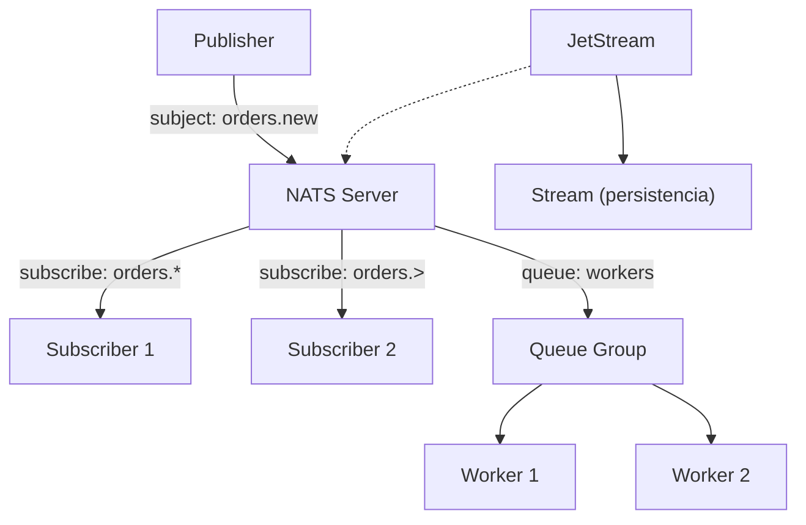

# NATS

## Qué es

Sistema de mensajería ligero y de alto rendimiento, diseñado para cloud-native, IoT y microservicios. Desarrollado originalmente por Derek Collison (Synadia Communications) en 2010.

- **Licencia:** Apache 2.0
- **Creador:** Synadia Communications
- **Protocolo:** TCP texto/binario
- **Puertos en serialplab:** 11024 (cliente), 11025 (monitoring)

## Conceptos clave

- **Core NATS:** Pub/sub puro, at-most-once delivery. Ultra-baja latencia.
- **Subjects:** Cadenas de texto jerárquicas separadas por `.` (ej. `orders.new`, `orders.*.shipped`).
- **Wildcards:**
  - `*` — coincide con un token (ej. `orders.*`).
  - `>` — coincide con uno o más tokens (ej. `orders.>`).
- **Queue Groups:** Consumers que comparten la carga de un subject. Un mensaje es procesado por un solo miembro del grupo.
- **Request-Reply:** Patrón de comunicación síncrona sobre pub/sub.
- **JetStream:** Capa de persistencia sobre Core NATS. Proporciona at-least-once y exactly-once delivery, retención de mensajes y consumer durables.
- **Streams:** En JetStream, almacena mensajes de uno o más subjects.
- **Consumers:** En JetStream, subscriptores durables con tracking de posición.
- **Leaf Nodes:** Conexiones entre clusters NATS para topologías distribuidas.
- **NKEY:** Sistema de autenticación basado en Ed25519.

## Arquitectura



## Instalación / Docker

```bash
docker run -d --name nats \
  -p 11024:4222 \
  -p 11025:8222 \
  nats:latest

# Con JetStream
docker run -d --name nats \
  -p 11024:4222 \
  -p 11025:8222 \
  nats:latest -js
```

Monitoring disponible en `http://localhost:11025`.

## Uso en serialplab

NATS es uno de los 3 brokers de mensajería utilizados. Representa el paradigma de mensajería ligera con baja latencia.

- [spec nats](../../specs/brokers/nats.md)

## Referencias

- [NATS](https://nats.io/)
- [NATS Documentation](https://docs.nats.io/)
- [JetStream](https://docs.nats.io/nats-concepts/jetstream)
