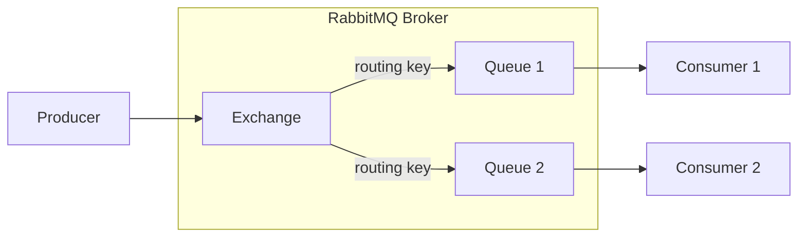

# RabbitMQ

## Qué es

Broker de mensajería open source que implementa AMQP (Advanced Message Queuing Protocol). Es el broker de mensajería más desplegado del mundo. Desarrollado por Rabbit Technologies (ahora parte de VMware/Broadcom), escrito en Erlang.

- **Licencia:** MPL 2.0 (Mozilla Public License)
- **Creador:** Rabbit Technologies / VMware
- **Protocolo:** AMQP 0-9-1 (también STOMP, MQTT)
- **Puertos en serialplab:** 11022 (AMQP), 11023 (Management UI)

## Conceptos clave

- **Exchange:** Punto de entrada de mensajes. Recibe mensajes del producer y los enruta a queues según reglas (bindings).
- **Queue:** Cola donde se almacenan los mensajes hasta que un consumer los procesa.
- **Binding:** Regla que conecta un exchange con una queue, usando un routing key o patrón.
- **Routing key:** Clave usada por el exchange para decidir a qué queue enviar el mensaje.
- **Exchange types:**
  - **Direct:** Routing exacto por key.
  - **Fanout:** Broadcast a todas las queues asociadas.
  - **Topic:** Routing por patrón (wildcards `*` y `#`).
  - **Headers:** Routing por headers del mensaje.
- **Acknowledgement (ack):** El consumer confirma el procesamiento del mensaje. Sin ack, el mensaje se reenvía.
- **Prefetch:** Número máximo de mensajes sin ack que un consumer puede tener.
- **Virtual Host (vhost):** Aislamiento lógico dentro de un mismo broker.
- **Durability:** Queues y mensajes pueden ser persistentes (sobreviven reinicios).

## Arquitectura



## Instalación / Docker

```bash
docker run -d --name rabbitmq \
  -p 11022:5672 \
  -p 11023:15672 \
  rabbitmq:management
```

Management UI disponible en `http://localhost:11023` (guest/guest).

## Uso en serialplab

RabbitMQ es uno de los 3 brokers de mensajería utilizados. Representa el paradigma de cola de mensajes tradicional con routing flexible.

- [spec rabbitmq](../../specs/brokers/rabbitmq.md)

## Referencias

- [RabbitMQ](https://www.rabbitmq.com/)
- [RabbitMQ Tutorials](https://www.rabbitmq.com/tutorials)
- [AMQP 0-9-1 Model](https://www.rabbitmq.com/tutorials/amqp-concepts)
