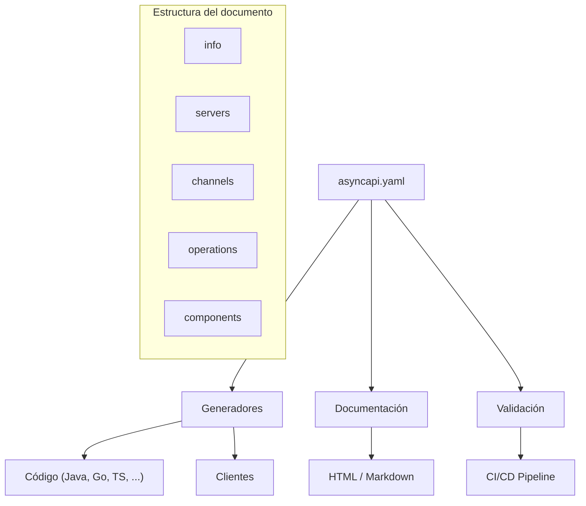

# AsyncAPI

## Qué es

Especificación open source para definir, documentar y generar código a partir de APIs asíncronas orientadas a eventos. Similar a OpenAPI pero para comunicación asíncrona (brokers de mensajería, WebSockets, etc.). Creado por Fran Méndez en 2017.

- **Licencia:** Apache 2.0
- **Creador:** Fran Méndez / AsyncAPI Initiative
- **Versión actual:** AsyncAPI 3.0

## Conceptos clave

- **Info:** Metadatos de la API (título, versión, descripción).
- **Servers:** Definición de brokers y protocolos de conexión.
- **Channels:** Representan topics, queues o subjects. Es el "camino" por donde fluyen los mensajes.
- **Operations:** Definen las acciones sobre canales (`send` y `receive` en v3).
- **Messages:** Estructura del payload con headers y content type.
- **Schemas:** Definición de la estructura de datos (compatible con JSON Schema).
- **Bindings:** Configuración específica de protocolo (Kafka bindings, AMQP bindings, NATS bindings).
- **Components:** Sección para elementos reutilizables (schemas, messages, channels).
- **Traits:** Mixins para reutilizar configuración entre operaciones o mensajes.
- **Tags:** Etiquetas para organización y documentación.

## Arquitectura



### Ejemplo mínimo (v3)

```yaml
asyncapi: 3.0.0
info:
  title: serialplab Messages API
  version: 1.0.0

servers:
  kafka:
    host: kafka:11021
    protocol: kafka

channels:
  messages:
    address: serialplab.messages
    messages:
      message:
        $ref: '#/components/messages/Message'

operations:
  publishMessage:
    action: send
    channel:
      $ref: '#/channels/messages'

components:
  messages:
    Message:
      payload:
        type: object
        properties:
          id:
            type: string
            format: uuid
          content:
            type: string
          timestamp:
            type: string
            format: date-time
```

## Herramientas

| Herramienta | Descripción |
|---|---|
| `@asyncapi/cli` | CLI oficial para validar, generar y gestionar specs |
| `@asyncapi/generator` | Generador de código y documentación |
| `@asyncapi/studio` | Editor visual web para specs AsyncAPI |
| `@asyncapi/parser-js` | Parser JavaScript para documentos AsyncAPI |

```bash
# Instalar CLI
npm install -g @asyncapi/cli

# Validar spec
asyncapi validate asyncapi/kafka.asyncapi.yaml

# Generar documentación HTML
asyncapi generate fromTemplate asyncapi/kafka.asyncapi.yaml @asyncapi/html-template
```

## Uso en serialplab

AsyncAPI 3.0 documenta los contratos de comunicación asíncrona entre servicios. Existe un archivo por broker:

```
asyncapi/
├── kafka.asyncapi.yaml
├── rabbitmq.asyncapi.yaml
└── nats.asyncapi.yaml
```

- Ver [ARCHITECTURE.md](../../ARCHITECTURE.md) sección "AsyncAPI"

## Referencias

- [AsyncAPI](https://www.asyncapi.com/)
- [AsyncAPI Specification 3.0](https://www.asyncapi.com/docs/reference/specification/v3.0.0)
- [AsyncAPI Studio](https://studio.asyncapi.com/)
- [AsyncAPI Tools](https://www.asyncapi.com/tools)
