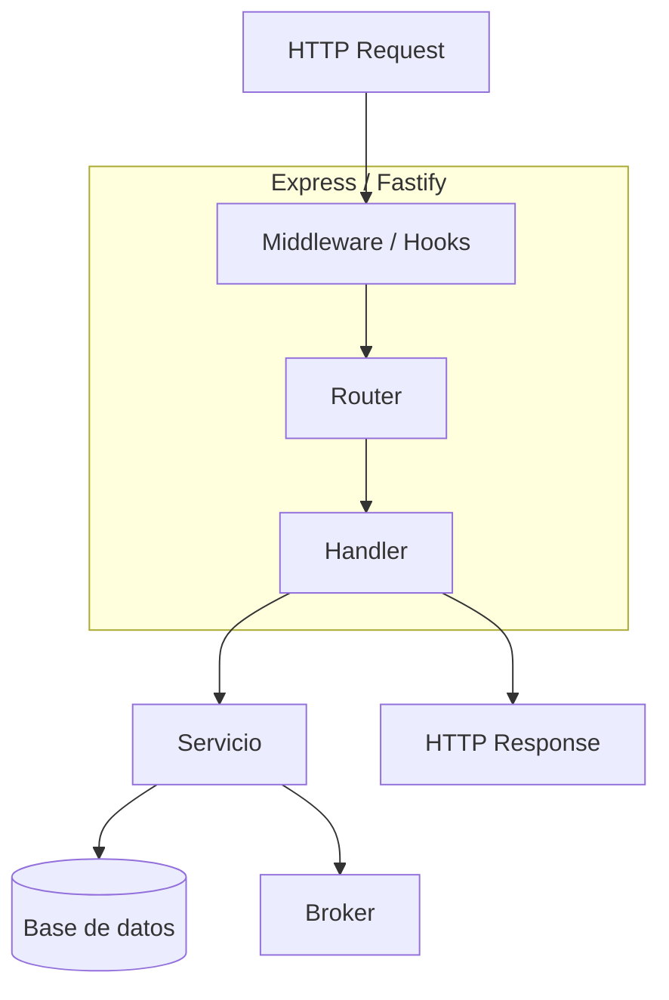

# Express / Fastify

## Qué es

**Express** es el framework web minimalista más popular para Node.js. Creado por TJ Holowaychuk (2010). Proporciona un modelo de middleware flexible.

**Fastify** es un framework web de alto rendimiento para Node.js, inspirado en Express y Hapi. Creado por Matteo Collina y Tomas Della Vedova (2017). Enfocado en velocidad y bajo overhead.

- **Licencia:** MIT (ambos)
- **Express versión:** 4.x / 5.x
- **Fastify versión:** 4.x

## Conceptos clave

### Express

- **Middleware:** Funciones que procesan requests en cadena (`req, res, next`).
- **Router:** Enrutamiento declarativo con métodos HTTP (`app.get()`, `app.post()`).
- **Error handling:** Middleware con 4 parámetros `(err, req, res, next)`.
- **Template engines:** Soporte para Pug, EJS, Handlebars.

### Fastify

- **Schema validation:** Validación automática de request/response con JSON Schema.
- **Plugins:** Sistema de encapsulación con `fastify.register()`.
- **Serialización rápida:** Usa `fast-json-stringify` para serializar responses.
- **Hooks:** Lifecycle hooks (`onRequest`, `preParsing`, `onSend`, etc.).
- **Decorators:** Extienden la instancia de Fastify (`decorate`, `decorateRequest`).

## Arquitectura



## Instalación

```bash
# Express
npm init -y
npm install express

# Fastify
npm init -y
npm install fastify
```

### Ejemplo mínimo

```javascript
// Express
import express from 'express';
const app = express();
app.get('/health', (req, res) => res.json({ status: 'ok' }));
app.listen(8084);

// Fastify
import Fastify from 'fastify';
const app = Fastify();
app.get('/health', async () => ({ status: 'ok' }));
app.listen({ port: 8084 });
```

## Uso en serialplab

Express o Fastify es el framework HTTP de **service-node**, proporcionando:
- API REST para health checks y endpoints de prueba
- Routing para publicación y consumo de mensajes
- Middleware de serialización/deserialización

- [spec service-node](../../specs/services/service-node.md)

## Referencias

- [Express](https://expressjs.com/)
- [Fastify](https://fastify.dev/)
- [Fastify Documentation](https://fastify.dev/docs/latest/)
