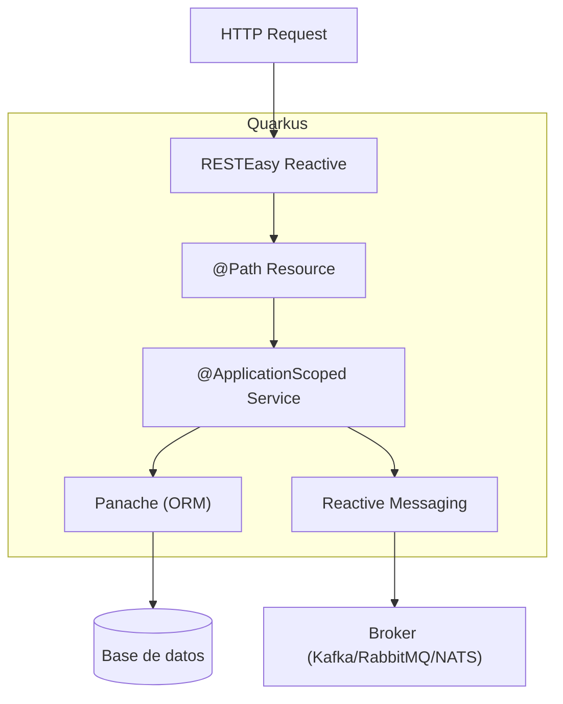

# Quarkus

## Qué es

Framework Java nativo de Kubernetes, optimizado para GraalVM y OpenJDK HotSpot. Diseñado para tiempos de arranque ultra-rápidos y bajo consumo de memoria. Desarrollado por Red Hat.

- **Licencia:** Apache 2.0
- **Versión utilizada:** Quarkus 3.x
- **Requisito:** Java 17+ (serialplab usa Java 21)

## Conceptos clave

- **Compilación nativa (GraalVM):** Compila a binario nativo, eliminando la JVM en runtime. Arranque en milisegundos.
- **Build-time processing:** Mucha lógica de frameworks se ejecuta en tiempo de compilación, no en runtime.
- **CDI (Contexts and Dependency Injection):** Inyección de dependencias basada en el estándar Jakarta CDI.
- **Dev mode (`quarkus dev`):** Hot-reload automático durante desarrollo.
- **Extensions:** Plugins que integran librerías con el modelo de build de Quarkus.
- **SmallRye:** Implementaciones de MicroProfile (Reactive Messaging, Health, Metrics).
- **RESTEasy Reactive:** Implementación reactiva de Jakarta REST (JAX-RS).
- **application.properties:** Configuración con perfiles (`%dev`, `%prod`).

## Arquitectura



## Instalación

```bash
# Generar proyecto
quarkus create app com.example:my-app \
  --extension='rest,hibernate-orm-panache,jdbc-postgresql,messaging-kafka'

# Dev mode
quarkus dev

# Build nativo
quarkus build --native
```

### Docker

```dockerfile
# JVM mode
FROM eclipse-temurin:21-jre-alpine
COPY target/quarkus-app/ /app/
CMD ["java", "-jar", "/app/quarkus-run.jar"]

# Native mode
FROM registry.access.redhat.com/ubi8/ubi-minimal
COPY target/*-runner /app
CMD ["/app"]
```

## Uso en serialplab

Quarkus 3 es el framework de **service-quarkus**, proporcionando:
- API REST con RESTEasy Reactive
- Integración con Kafka via SmallRye Reactive Messaging
- Integración con RabbitMQ via SmallRye AMQP
- Acceso a PostgreSQL via Hibernate con Panache

- [spec service-quarkus](../../specs/services/service-quarkus.md)

## Referencias

- [Quarkus](https://quarkus.io/)
- [Quarkus Guides](https://quarkus.io/guides/)
- [Quarkus Extensions](https://quarkus.io/extensions/)
