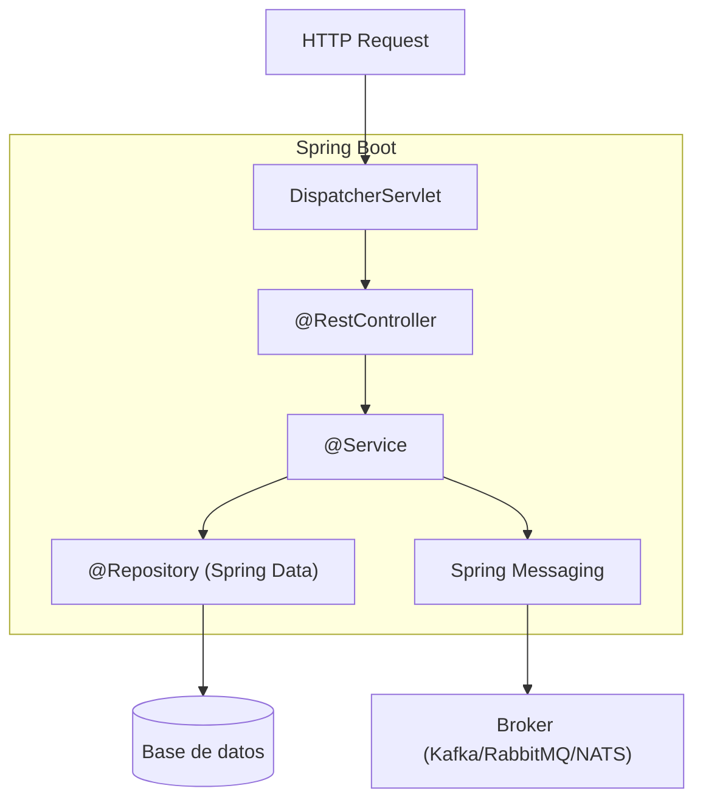

# Spring Boot

## Qué es

Framework de Java que simplifica la creación de aplicaciones Spring production-ready. Proporciona autoconfiguración, servidor embebido y un modelo opinionado de convención sobre configuración. Creado por Pivotal (ahora VMware Tanzu).

- **Licencia:** Apache 2.0
- **Versión utilizada:** Spring Boot 3.x (Spring Framework 6.x)
- **Requisito:** Java 17+ (serialplab usa Java 21)

## Conceptos clave

- **Autoconfiguración:** Configura automáticamente beans y componentes basándose en las dependencias del classpath.
- **Starters:** Dependencias agrupadas que incluyen todo lo necesario para una funcionalidad (ej. `spring-boot-starter-web`).
- **Actuator:** Endpoints de monitorización (`/health`, `/metrics`, `/info`).
- **Spring IoC Container:** Inversión de control mediante inyección de dependencias (`@Autowired`, `@Component`).
- **Spring MVC:** Framework web basado en el patrón MVC para APIs REST.
- **Spring Data JPA:** Abstracción sobre JPA para acceso a datos con repositorios declarativos.
- **Spring Messaging:** Abstracción para mensajería (Kafka, RabbitMQ, etc.).
- **application.yml:** Configuración externalizada con perfiles.

## Arquitectura



## Instalación

```bash
# Generar proyecto
curl https://start.spring.io/starter.zip \
  -d dependencies=web,actuator,data-jpa,kafka \
  -d javaVersion=21 \
  -d type=maven-project \
  -o project.zip

# Build
./mvnw package

# Ejecutar
java -jar target/app.jar
```

### Docker

```dockerfile
FROM eclipse-temurin:21-jre-alpine
COPY target/*.jar app.jar
ENTRYPOINT ["java", "-jar", "app.jar"]
```

## Uso en serialplab

Spring Boot 3 es el framework de **service-springboot**, proporcionando:
- API REST con Spring MVC
- Integración con Kafka via `spring-kafka`
- Integración con RabbitMQ via `spring-amqp`
- Acceso a PostgreSQL via Spring Data JPA

- [spec service-springboot](../../specs/services/service-springboot.md)

## Referencias

- [Spring Boot](https://spring.io/projects/spring-boot)
- [Spring Boot Reference](https://docs.spring.io/spring-boot/reference/)
- [Spring Initializr](https://start.spring.io/)
