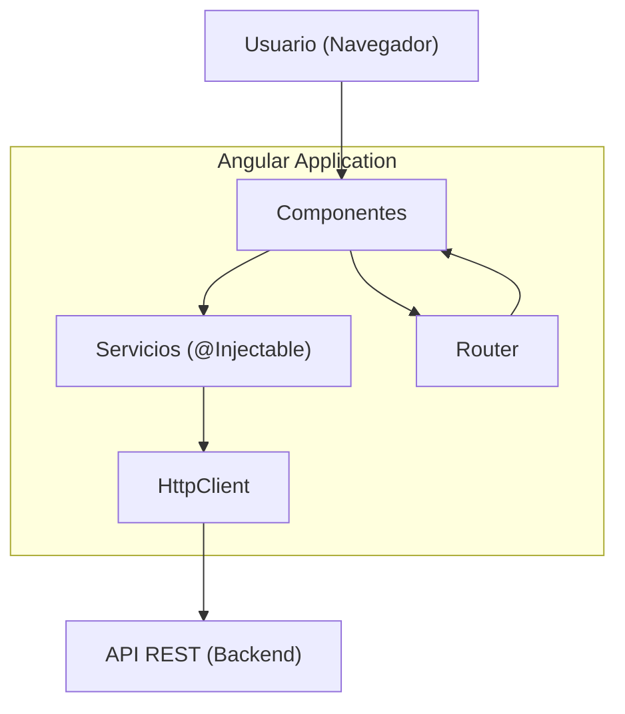

# Angular

## Qué es

Framework de desarrollo web mantenido por Google para construir aplicaciones single-page (SPA) y progressive web apps (PWA). Utiliza TypeScript como lenguaje principal y proporciona un ecosistema completo con routing, formularios, HTTP client, testing y herramientas de build integradas.

- **Licencia:** MIT
- **Versión utilizada:** Angular 19
- **Requisito:** Node.js 22+ y TypeScript 5.x

## Conceptos clave

- **Componentes:** Bloque fundamental de la UI. Cada componente tiene un template (HTML), estilos (CSS) y lógica (TypeScript). Desde Angular 14+, pueden ser standalone (sin módulos).
- **Signals:** Sistema reactivo introducido en Angular 16. Permite rastrear cambios de estado de forma granular sin Zone.js, mejorando el rendimiento.
- **Servicios e inyección de dependencias:** Clases decoradas con `@Injectable()` que encapsulan lógica de negocio. Angular las inyecta automáticamente donde se necesitan.
- **HttpClient:** Módulo para realizar peticiones HTTP. Retorna Observables (RxJS) y soporta interceptores para autenticación, logging, etc.
- **Router:** Sistema de navegación SPA con lazy loading, guards y resolvers.
- **Reactive Forms:** Sistema de formularios basado en `FormGroup` y `FormControl` con validación síncrona y asíncrona.
- **Angular CLI:** Herramienta de línea de comandos para crear, desarrollar, compilar y testear proyectos Angular (`ng new`, `ng serve`, `ng build`).

## Arquitectura



### Flujo de datos

1. El **Router** carga el componente correspondiente a la ruta actual.
2. El **Componente** utiliza **Servicios** para obtener o enviar datos.
3. Los **Servicios** usan **HttpClient** para comunicarse con APIs REST.
4. Los **Signals** notifican cambios de estado al componente para re-renderizar.

## Instalación

```bash
# Instalar Angular CLI
npm install -g @angular/cli

# Crear proyecto
ng new frontend-angular --standalone --style=css --routing

# Desarrollo
cd frontend-angular
ng serve --port 11000  # http://localhost:11000

# Build de producción
ng build --configuration=production
```

### Docker

```dockerfile
FROM node:22-alpine AS build
WORKDIR /app
COPY package*.json ./
RUN npm ci
COPY . .
RUN npm run build -- --configuration=production

FROM nginx:alpine
COPY --from=build /app/dist/frontend-angular/browser /usr/share/nginx/html
EXPOSE 11000
```

## Uso en serialplab

Angular 19 es el framework de **frontend-angular**, proporcionando:

- SPA con routing para dashboard y CRUD de usuarios
- HttpClient para comunicarse con los 4 servicios backend
- Signals para gestión de estado reactiva
- Formularios reactivos para el CRUD de User
- Construcción dinámica de URLs según la combinación servicio/protocolo/broker seleccionada

- [spec frontend-angular](../../specs/frontend/frontend-angular.md)

## Referencias

- [Angular](https://angular.dev/)
- [Angular CLI](https://angular.dev/tools/cli)
- [Angular Signals](https://angular.dev/guide/signals)
- [TypeScript](https://www.typescriptlang.org/)
