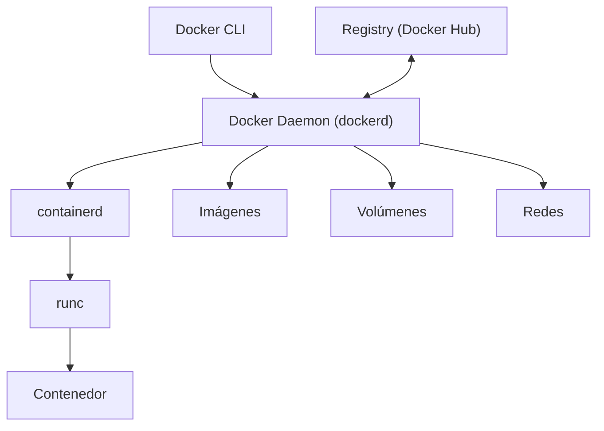

# Docker

## Qué es

Plataforma de contenedores que permite empaquetar, distribuir y ejecutar aplicaciones en entornos aislados y reproducibles. Creado por Solomon Hykes en dotCloud (2013).

- **Licencia:** Apache 2.0 (Docker Engine)
- **Creador:** Docker, Inc.
- **Componentes principales:** Docker Engine, Docker CLI, Docker Compose

## Conceptos clave

- **Imagen:** Plantilla de solo lectura con el sistema de archivos y configuración para crear contenedores. Se construye a partir de un `Dockerfile`.
- **Contenedor:** Instancia ejecutable de una imagen. Aislado a nivel de proceso, red y filesystem.
- **Dockerfile:** Archivo de instrucciones para construir una imagen (`FROM`, `COPY`, `RUN`, `CMD`, `ENTRYPOINT`).
- **Layers:** Cada instrucción del Dockerfile crea una capa. Las capas se cachean para builds incrementales.
- **Registry:** Almacén de imágenes (Docker Hub, GitHub Container Registry, etc.).
- **Volumes:** Persistencia de datos fuera del filesystem del contenedor.
- **Networks:** Redes virtuales para comunicación entre contenedores.
- **Docker Compose:** Herramienta para definir y ejecutar aplicaciones multi-contenedor con `docker-compose.yml`.
- **Profiles:** En Compose, permiten agrupar servicios para levantarlos selectivamente.
- **Multi-stage builds:** Múltiples etapas `FROM` en un Dockerfile para optimizar el tamaño de la imagen final.

## Arquitectura



## Instalación

```bash
# Ubuntu
sudo apt install docker.io docker-compose-v2

# Verificar
docker --version
docker compose version

# Añadir usuario al grupo docker
sudo usermod -aG docker $USER
```

## Uso en serialplab

Docker y Docker Compose orquestan toda la infraestructura del proyecto mediante dos perfiles:

- **`infra`:** PostgreSQL, ZooKeeper, Kafka, RabbitMQ, NATS, Apicurio Registry
- **`app`:** service-springboot, service-quarkus, service-go, service-node

```bash
# Solo infraestructura
docker compose --profile infra up -d

# Todo
docker compose --profile infra --profile app up -d
```

- Ver [ARCHITECTURE.md](../../ARCHITECTURE.md) sección "Docker Compose"

## Referencias

- [Docker](https://www.docker.com/)
- [Docker Documentation](https://docs.docker.com/)
- [Docker Compose](https://docs.docker.com/compose/)
- [Dockerfile Reference](https://docs.docker.com/reference/dockerfile/)
