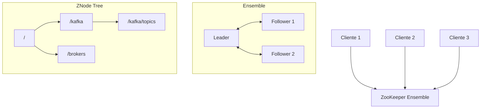

# Apache ZooKeeper

## Qué es

Servicio centralizado de coordinación para sistemas distribuidos. Proporciona configuración distribuida, sincronización, naming y group services. Desarrollado originalmente en Yahoo! y donado a Apache Software Foundation.

- **Licencia:** Apache 2.0
- **Creador:** Yahoo! / Apache Software Foundation
- **Puerto por defecto:** 2181

## Conceptos clave

- **ZNode:** Nodo en el namespace jerárquico de ZooKeeper (similar a un filesystem). Cada znode puede contener datos y tener hijos.
- **Ephemeral znodes:** Nodos temporales que se eliminan cuando la sesión del cliente se cierra. Usados para detectar fallos.
- **Sequential znodes:** Nodos con un sufijo numérico auto-incrementado. Usados para locks distribuidos y elección de líder.
- **Watches:** Mecanismo de notificación. Un cliente puede registrar un watch en un znode y ser notificado cuando cambie.
- **Sessions:** Conexión con estado entre cliente y servidor. Tiene un timeout configurable.
- **Ensemble:** Cluster de servidores ZooKeeper. Requiere quorum (mayoría) para operar.
- **Leader election:** Un servidor del ensemble es el leader (gestiona escrituras), el resto son followers (sirven lecturas).
- **Atomic broadcast (Zab):** Protocolo de consenso interno para replicar cambios entre servidores.

## Arquitectura



## Instalación / Docker

```bash
docker run -d --name zookeeper \
  -e ZOOKEEPER_CLIENT_PORT=2181 \
  -p 2181:2181 \
  confluentinc/cp-zookeeper:7.6.0
```

## Uso en serialplab

ZooKeeper es una dependencia de infraestructura de Apache Kafka. Gestiona metadatos del cluster Kafka (brokers, topics, particiones, líder).

> **Nota:** En versiones recientes, Kafka puede operar sin ZooKeeper usando KRaft mode. En serialplab se usa ZooKeeper por compatibilidad con la imagen Confluent.

- Ver [doc kafka](../brokers/kafka.md)

## Referencias

- [Apache ZooKeeper](https://zookeeper.apache.org/)
- [ZooKeeper Documentation](https://zookeeper.apache.org/doc/current/)
- [ZooKeeper Internals](https://zookeeper.apache.org/doc/current/zookeeperInternals.html)
