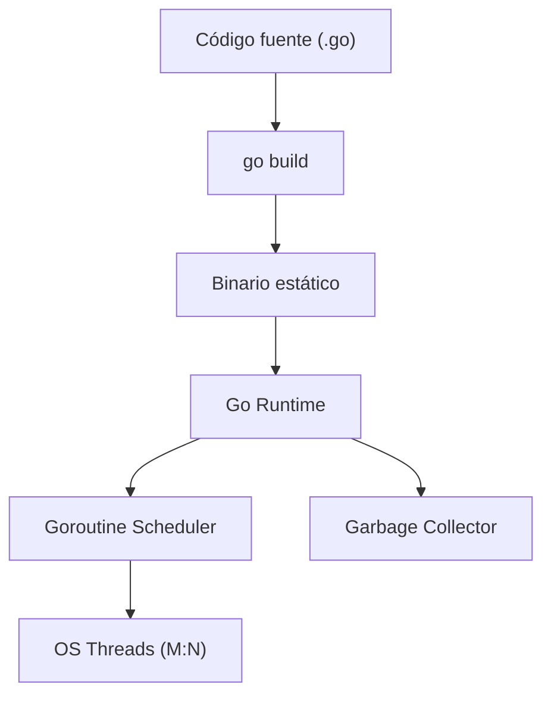

# Go

## Qué es

Lenguaje de programación compilado, estáticamente tipado, diseñado por Google (Robert Griesemer, Rob Pike, Ken Thompson) en 2009. Orientado a simplicidad, concurrencia y alto rendimiento.

- **Licencia:** BSD 3-Clause
- **Versión utilizada:** Go 1.22+
- **Paradigma:** Imperativo, concurrente

## Conceptos clave

- **Goroutines:** Threads ligeros gestionados por el runtime de Go. Miles de goroutines pueden ejecutarse concurrentemente con bajo overhead.
- **Channels:** Mecanismo de comunicación entre goroutines siguiendo el modelo CSP (Communicating Sequential Processes).
- **Interfaces:** Tipado estructural implícito — un tipo implementa una interfaz si tiene los métodos requeridos, sin declaración explícita.
- **Módulos (go.mod):** Sistema de gestión de dependencias y versionado.
- **Defer:** Ejecuta una función al salir del scope actual, útil para limpieza de recursos.
- **Error handling:** Sin excepciones. Las funciones retornan `(valor, error)` como convención.
- **Binarios estáticos:** Compilación a un único binario sin dependencias externas.

## Arquitectura



## Instalación

```bash
# Ubuntu/Debian
sudo apt install golang-go

# O descarga directa
wget https://go.dev/dl/go1.22.linux-amd64.tar.gz
sudo tar -C /usr/local -xzf go1.22.linux-amd64.tar.gz

# Verificar
go version
```

### Docker

```dockerfile
FROM golang:1.22-alpine AS builder
WORKDIR /app
COPY . .
RUN go build -o server .

FROM alpine:3.19
COPY --from=builder /app/server /server
CMD ["/server"]
```

## Uso en serialplab

Go 1.22+ es el runtime de **service-go**, que produce binarios estáticos de alto rendimiento.

- [spec service-go](../../specs/services/service-go.md)

## Referencias

- [Go Official](https://go.dev/)
- [Go Documentation](https://go.dev/doc/)
- [Effective Go](https://go.dev/doc/effective_go)
- [Go by Example](https://gobyexample.com/)
