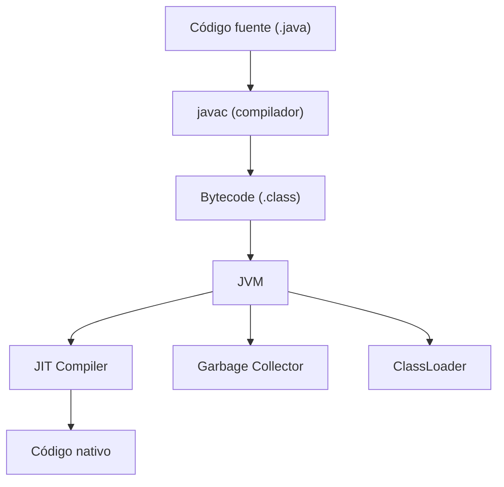

# Java

## Qué es

Lenguaje de programación orientado a objetos, fuertemente tipado y compilado a bytecode que se ejecuta sobre la Java Virtual Machine (JVM). Creado por James Gosling en Sun Microsystems (1995), actualmente mantenido por Oracle.

- **Licencia:** GPL v2 (OpenJDK)
- **Versión utilizada:** Java 21 (LTS)
- **Paradigma:** Orientado a objetos, funcional (desde Java 8)

## Conceptos clave

- **JVM (Java Virtual Machine):** Máquina virtual que ejecuta bytecode Java. Permite portabilidad ("write once, run anywhere").
- **JDK vs JRE:** JDK incluye compilador y herramientas de desarrollo; JRE solo el runtime.
- **Garbage Collection:** Gestión automática de memoria con múltiples algoritmos (G1, ZGC, Shenandoah).
- **Classpath:** Mecanismo para localizar clases y paquetes en tiempo de ejecución.
- **Maven / Gradle:** Sistemas de build y gestión de dependencias.
- **Records:** Clases inmutables de datos (desde Java 16).
- **Virtual Threads:** Threads ligeros gestionados por la JVM (desde Java 21, Project Loom).
- **Pattern Matching:** Coincidencia de patrones en `instanceof` y `switch` (desde Java 21).

## Arquitectura



## Instalación

```bash
# Ubuntu/Debian
sudo apt install openjdk-21-jdk

# Verificar
java --version
javac --version
```

### Docker

```dockerfile
FROM eclipse-temurin:21-jre-alpine
```

## Uso en serialplab

Java 21 es el runtime de los servicios **service-springboot** y **service-quarkus**.

- [spec service-springboot](../../specs/services/service-springboot.md)
- [spec service-quarkus](../../specs/services/service-quarkus.md)

## Referencias

- [OpenJDK](https://openjdk.org/)
- [Java SE Documentation](https://docs.oracle.com/en/java/javase/21/)
- [JEP Index](https://openjdk.org/jeps/0)
