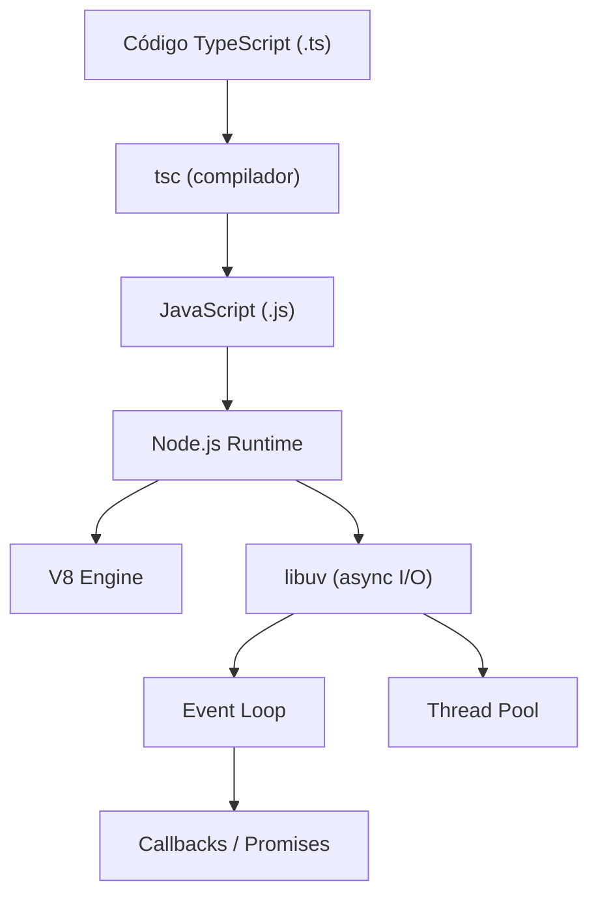

# Node.js + TypeScript

## Qué es

**Node.js** es un runtime de JavaScript construido sobre el motor V8 de Chrome. Permite ejecutar JavaScript en el servidor con un modelo de I/O no bloqueante y orientado a eventos. Creado por Ryan Dahl (2009).

**TypeScript** es un superset tipado de JavaScript desarrollado por Microsoft (2012). Añade tipado estático opcional y compila a JavaScript.

- **Licencia:** MIT (Node.js), Apache 2.0 (TypeScript)
- **Versión utilizada:** Node.js 22, TypeScript 5.x
- **Paradigma:** Orientado a eventos, funcional, orientado a objetos

## Conceptos clave

- **Event Loop:** Bucle de eventos single-threaded que gestiona operaciones asíncronas mediante callbacks, Promises y async/await.
- **npm / pnpm:** Gestores de paquetes para el ecosistema Node.js.
- **CommonJS vs ESM:** Dos sistemas de módulos. ESM (`import/export`) es el estándar moderno.
- **V8 Engine:** Motor JavaScript de Google que compila a código máquina nativo.
- **Streams:** Abstracción para manejar datos secuenciales (lectura/escritura) de forma eficiente.
- **Worker Threads:** Threads reales para operaciones CPU-intensivas.
- **Tipos en TypeScript:** `interface`, `type`, generics, union types, utility types.
- **tsconfig.json:** Configuración del compilador TypeScript.

## Arquitectura



## Instalación

```bash
# Via nvm (recomendado)
nvm install 22
nvm use 22

# TypeScript
npm install -g typescript

# Verificar
node --version
tsc --version
```

### Docker

```dockerfile
FROM node:22-alpine
WORKDIR /app
COPY package*.json ./
RUN npm ci --production
COPY dist/ ./dist/
CMD ["node", "dist/index.js"]
```

## Uso en serialplab

Node.js 22 es el runtime de **service-node**, con Express o Fastify como framework HTTP.

- [spec service-node](../../specs/services/service-node.md)

## Referencias

- [Node.js](https://nodejs.org/)
- [Node.js Documentation](https://nodejs.org/docs/latest-v22.x/api/)
- [TypeScript](https://www.typescriptlang.org/)
- [TypeScript Handbook](https://www.typescriptlang.org/docs/handbook/)
