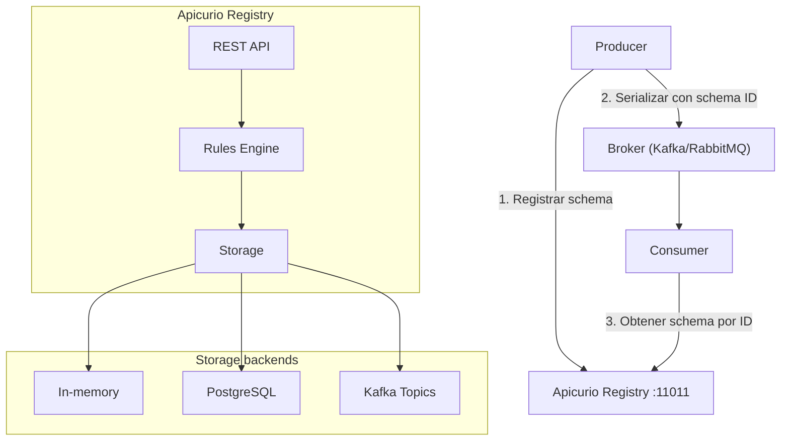

# Apicurio Registry

## Qué es

Registro de schemas y APIs open source que proporciona un almacén centralizado para definiciones de estructuras de datos. Compatible con Confluent Schema Registry API. Parte del proyecto Apicurio, desarrollado por Red Hat.

- **Licencia:** Apache 2.0
- **Creador:** Red Hat / Apicurio community
- **Puerto en serialplab:** 11011
- **Versión:** 2.x / 3.x

## Conceptos clave

- **Artifact:** Unidad fundamental de almacenamiento. Puede ser un schema (Avro, Protobuf, JSON Schema, etc.) o una definición de API (OpenAPI, AsyncAPI, GraphQL).
- **Artifact types:** Avro, Protobuf, JSON Schema, OpenAPI, AsyncAPI, GraphQL, WSDL, XML Schema (XSD), entre otros.
- **Groups:** Mecanismo de organización lógica de artifacts (similar a namespaces).
- **Versions:** Cada artifact puede tener múltiples versiones. El registro mantiene el historial completo.
- **Rules:** Reglas de validación que se aplican al crear o actualizar artifacts:
  - **Validity:** Verifica que el schema sea sintácticamente válido.
  - **Compatibility:** Verifica compatibilidad con versiones anteriores (backward, forward, full, none).
  - **Integrity:** Verifica integridad referencial entre schemas.
- **Global rules:** Reglas por defecto aplicadas a todos los artifacts.
- **Content canonicalization:** Normaliza el contenido de schemas para comparaciones consistentes.
- **Confluent API compatibility:** Expone endpoints compatibles con el API del Confluent Schema Registry, permitiendo usar clientes existentes.

## Arquitectura



### Storage backends

| Backend | Uso |
|---|---|
| **In-memory** | Desarrollo y testing |
| **PostgreSQL** | Producción (recomendado) |
| **Kafka** | Producción (datos en topics de Kafka) |

## Instalación / Docker

```bash
# In-memory (desarrollo)
docker run -d --name apicurio-registry \
  -p 11011:8080 \
  -e REGISTRY_STORAGE_KIND=mem \
  apicurio/apicurio-registry:2.6.2.Final

# Con PostgreSQL
docker run -d --name apicurio-registry \
  -p 11011:8080 \
  -e REGISTRY_STORAGE_KIND=sql \
  -e REGISTRY_STORAGE_SQL_KIND=postgresql \
  -e REGISTRY_DATASOURCE_URL=jdbc:postgresql://postgres:11010/registry \
  -e REGISTRY_DATASOURCE_USERNAME=registry \
  -e REGISTRY_DATASOURCE_PASSWORD=registry \
  apicurio/apicurio-registry:2.6.2.Final
```

### API REST

```bash
# Listar artifacts
curl http://localhost:11011/apis/registry/v3/groups/default/artifacts

# Registrar un schema Avro
curl -X POST http://localhost:11011/apis/registry/v3/groups/default/artifacts \
  -H "Content-Type: application/json" \
  -H "X-Registry-ArtifactId: message" \
  -H "X-Registry-ArtifactType: AVRO" \
  -d @schemas/avro/message.avsc

# Obtener schema por ID
curl http://localhost:11011/apis/registry/v3/groups/default/artifacts/message/versions/latest/content
```

### UI

Apicurio Registry incluye una UI web accesible en `http://localhost:11011/ui`.

## Uso en serialplab

Apicurio Registry centraliza la gestión de schemas de serialización del proyecto, proporcionando:
- Registro de schemas Avro, Protobuf y JSON Schema
- Validación de compatibilidad en actualizaciones
- API compatible con Confluent Schema Registry para integración con clientes Kafka

- [spec apicurio-registry](../../specs/registros/apicurio-registry.md)

## Referencias

- [Apicurio Registry](https://www.apicur.io/registry/)
- [Apicurio Registry Documentation](https://www.apicur.io/registry/docs/)
- [Apicurio GitHub](https://github.com/Apicurio/apicurio-registry)
- [Confluent Schema Registry API Compatibility](https://www.apicur.io/registry/docs/apicurio-registry/2.6.x/getting-started/assembly-using-the-registry-client.html)
