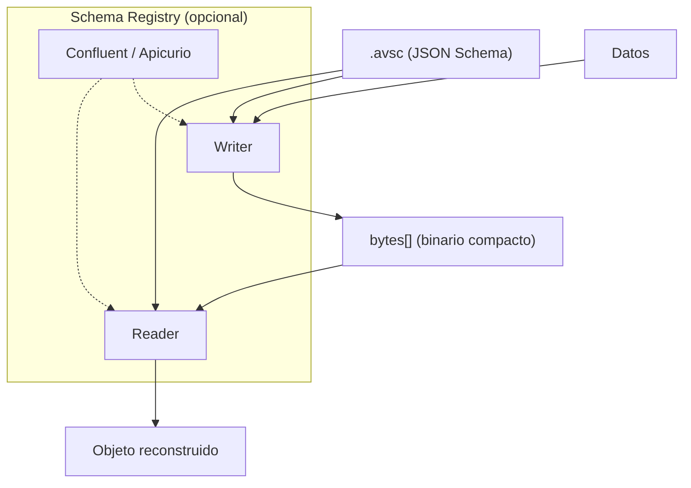

# Apache Avro

## Qué es

Sistema de serialización de datos que utiliza JSON para definir schemas y codificación binaria compacta para los datos. Proyecto de Apache Software Foundation, creado por Doug Cutting (creador de Hadoop) en 2009.

- **Licencia:** Apache 2.0
- **Creador:** Apache Software Foundation
- **Formato:** Binario (con schema JSON)
- **Schema:** Obligatorio (`.avsc`)

## Conceptos clave

- **Schema (`.avsc`):** Definición de tipos en formato JSON. Soporta tipos primitivos, records, enums, arrays, maps y unions.
- **Schema evolution:** Soporte nativo para compatibilidad hacia adelante (forward), hacia atrás (backward) y completa (full).
- **Schema resolution:** El lector puede usar un schema diferente al del escritor. Avro resuelve las diferencias automáticamente.
- **Container files (`.avro`):** Formato de archivo que incluye el schema junto con los datos. Auto-descriptivo.
- **Generic vs Specific:** API genérica (sin code-gen, usa `GenericRecord`) o específica (con code-gen, clases tipadas).
- **Logical types:** Extensiones semánticas sobre tipos primitivos (date, timestamp, decimal, uuid).
- **Codificación binaria:** Sin delimitadores ni field IDs — el schema define el orden de los campos.

## Arquitectura



## Instalación

```bash
# Java (Maven)
# <dependency>
#   <groupId>org.apache.avro</groupId>
#   <artifactId>avro</artifactId>
# </dependency>

# Herramientas CLI
pip install avro
```

## Uso en serialplab

Avro es uno de los 7 protocolos de serialización evaluados. Los schemas se ubican en `schemas/avro/`. Especialmente relevante en la integración con Kafka por su soporte de Schema Registry.

- [spec avro](../../specs/protocols/avro.md)

## Referencias

- [Apache Avro](https://avro.apache.org/)
- [Avro Specification](https://avro.apache.org/docs/current/specification/)
- [Schema Evolution](https://avro.apache.org/docs/current/specification/#schema-resolution)
