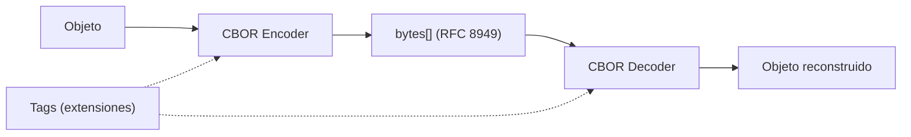

# CBOR (Concise Binary Object Representation)

## Qué es

Formato de serialización binaria basado en el modelo de datos de JSON, estandarizado como RFC 8949 por el IETF. Diseñado para ser extremadamente compacto, con codificación/decodificación rápida y sin necesidad de schema.

- **Licencia:** Estándar abierto (RFC 8949)
- **Creador:** IETF (Carsten Bormann, Paul Hoffman)
- **Formato:** Binario
- **Schema:** No obligatorio (schema-less)

## Conceptos clave

- **Modelo de datos:** Superset del modelo JSON: integers, floats, byte strings, text strings, arrays, maps, booleans, null, undefined.
- **Tags:** Mecanismo de extensión semántica. Cada tag (número) indica cómo interpretar el valor siguiente (ej. tag 0 = datetime string, tag 1 = epoch timestamp).
- **Major types:** 8 tipos principales codificados en los 3 bits más significativos del primer byte.
- **Deterministic encoding:** Modo de codificación determinista para generar siempre la misma representación binaria.
- **COSE (CBOR Object Signing and Encryption):** Extensión para firma y cifrado de datos CBOR.
- **Self-describing:** Prefijo opcional `0xd9d9f7` que identifica un stream CBOR.
- **Indefinite-length:** Soporte para arrays y maps de longitud indeterminada (streaming).

## Arquitectura



## Instalación

```bash
# Java (Maven)
# <dependency>
#   <groupId>com.fasterxml.jackson.dataformat</groupId>
#   <artifactId>jackson-dataformat-cbor</artifactId>
# </dependency>

# Go
go get github.com/fxamacker/cbor/v2

# Node.js
npm install cbor
```

## Uso en serialplab

CBOR es uno de los 7 protocolos de serialización evaluados. Al ser schema-less (como MessagePack), no tiene archivos en `schemas/`.

- [spec cbor](../../specs/protocols/cbor.md)

## Referencias

- [RFC 8949 — CBOR](https://www.rfc-editor.org/rfc/rfc8949)
- [CBOR.io](https://cbor.io/)
- [CBOR Playground](https://cbor.me/)
