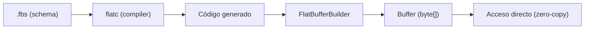

# FlatBuffers

## Qué es

Biblioteca de serialización eficiente para juegos y aplicaciones de alto rendimiento. Permite acceder a datos serializados sin deserialización completa (zero-copy). Desarrollada por Google, publicada en 2014.

- **Licencia:** Apache 2.0
- **Creador:** Google
- **Formato:** Binario (zero-copy)
- **Schema:** Obligatorio (`.fbs`)

## Conceptos clave

- **Zero-copy:** Los datos serializados se pueden leer directamente desde el buffer sin crear objetos intermedios. Sin allocations adicionales.
- **Schema (`.fbs`):** Define tablas, structs, enums y unions en un IDL propio.
- **Tables vs Structs:** Tables son flexibles (schema evolution, campos opcionales). Structs son fijos (sin overhead, inline).
- **vtable:** Tabla virtual que permite acceso aleatorio a campos y schema evolution.
- **FlatBufferBuilder:** API para construir buffers incrementalmente.
- **Acceso directo:** Se lee un campo específico sin deserializar todo el mensaje.
- **Offsets:** Los campos se referencian por offsets dentro del buffer.
- **Schema evolution:** Se pueden añadir campos al final de una tabla sin romper compatibilidad.

## Arquitectura



## Instalación

```bash
# Compilador
sudo apt install flatbuffers-compiler

# Verificar
flatc --version

# Generar código
flatc --java message.fbs
flatc --go message.fbs
flatc --ts message.fbs
```

## Uso en serialplab

FlatBuffers es uno de los 7 protocolos de serialización evaluados. Los schemas se ubican en `schemas/flatbuffers/`. Destaca por su capacidad zero-copy en lectura.

- [spec flatbuffers](../../specs/protocols/flatbuffers.md)

## Referencias

- [FlatBuffers](https://flatbuffers.dev/)
- [FlatBuffers Schema](https://flatbuffers.dev/flatbuffers_guide_writing_schema.html)
- [FlatBuffers Internals](https://flatbuffers.dev/flatbuffers_internals.html)
