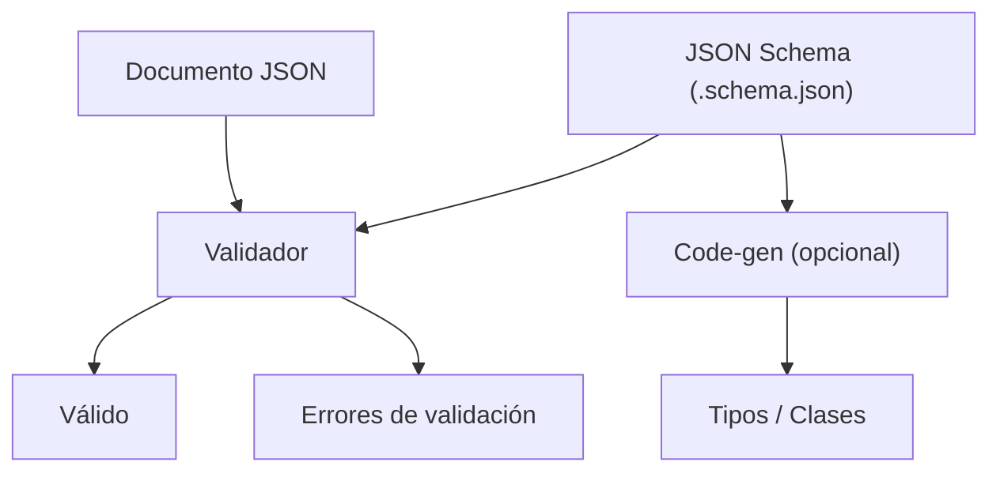

# JSON Schema

## Qué es

Vocabulario para anotar y validar documentos JSON. Permite definir la estructura, tipos y restricciones de datos JSON de forma declarativa. Estándar abierto con especificación mantenida por la comunidad.

- **Licencia:** Especificación abierta (sin licencia restrictiva)
- **Versión actual:** Draft 2020-12
- **Formato:** Texto (JSON)
- **Schema:** Sí (JSON Schema)

## Conceptos clave

- **`$schema`:** Declara la versión de JSON Schema utilizada.
- **`type`:** Define el tipo de dato (`object`, `array`, `string`, `number`, `integer`, `boolean`, `null`).
- **`properties`:** Define las propiedades de un objeto y sus schemas.
- **`required`:** Lista de propiedades obligatorias.
- **`$ref`:** Referencia a otro schema (composición, reutilización).
- **`additionalProperties`:** Controla si se permiten propiedades no declaradas.
- **Formatos:** Validación semántica (`date-time`, `email`, `uri`, `uuid`).
- **Composición:** `allOf`, `anyOf`, `oneOf`, `not` para schemas compuestos.
- **`$defs`:** Definiciones reutilizables dentro del mismo documento.

## Arquitectura



## Instalación

```bash
# Java (Maven) — usando Jackson
# <dependency>
#   <groupId>com.networknt</groupId>
#   <artifactId>json-schema-validator</artifactId>
# </dependency>

# Go
go get github.com/santhosh-tekuri/jsonschema/v5

# Node.js
npm install ajv
```

## Uso en serialplab

JSON Schema es el formato baseline (texto, legible por humanos) contra el que se comparan los protocolos binarios. Los schemas se ubican en `schemas/jsonschema/`.

- [spec json-schema](../../specs/protocols/json-schema.md)

## Referencias

- [JSON Schema](https://json-schema.org/)
- [JSON Schema Specification](https://json-schema.org/specification)
- [Understanding JSON Schema](https://json-schema.org/understanding-json-schema)
