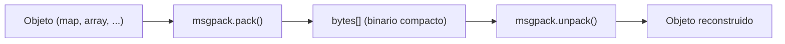

# MessagePack

## Qué es

Formato de serialización binaria eficiente, similar a JSON pero más compacto y rápido. Schema-less (no requiere definición de schema previa). Creado por Sadayuki Furuhashi en 2008.

- **Licencia:** Apache 2.0 (especificación) / MIT (implementaciones)
- **Creador:** Sadayuki Furuhashi
- **Formato:** Binario
- **Schema:** No obligatorio (schema-less)

## Conceptos clave

- **"It's like JSON, but fast and small":** Comparte el modelo de datos de JSON (maps, arrays, strings, integers, floats, booleans, null) pero en representación binaria.
- **Tipos nativos:** nil, bool, int (signed/unsigned 8-64 bits), float (32/64), str, bin (bytes), array, map, ext (extensiones).
- **Extension types:** Mecanismo para definir tipos personalizados con un type ID (int8) y datos binarios.
- **Timestamp extension:** Tipo de extensión estándar para timestamps con precisión de nanosegundos.
- **Compactación:** Enteros pequeños (0-127) se codifican en 1 byte. Strings cortas incluyen la longitud en el primer byte.
- **Sin schema:** Los datos se auto-describen. No hay paso de code-gen ni archivos de definición.

## Arquitectura



## Instalación

```bash
# Java (Maven)
# <dependency>
#   <groupId>org.msgpack</groupId>
#   <artifactId>msgpack-core</artifactId>
# </dependency>

# Go
go get github.com/vmihailenco/msgpack/v5

# Node.js
npm install @msgpack/msgpack
```

## Uso en serialplab

MessagePack es uno de los 7 protocolos de serialización evaluados. Al ser schema-less, no tiene archivos en `schemas/` y funciona como serialización directa de objetos.

- [spec messagepack](../../specs/protocols/messagepack.md)

## Referencias

- [MessagePack](https://msgpack.org/)
- [MessagePack Specification](https://github.com/msgpack/msgpack/blob/master/spec.md)
