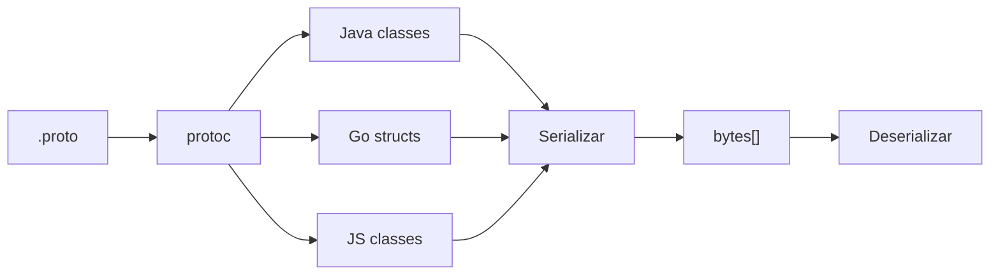

# Protocol Buffers (Protobuf)

## Qué es

Mecanismo de serialización de datos estructurados, neutral respecto al lenguaje y la plataforma. Desarrollado por Google y publicado como open source en 2008. Es el formato de serialización nativo de gRPC.

- **Licencia:** BSD 3-Clause
- **Creador:** Google
- **Formato:** Binario
- **Schema:** Obligatorio (`.proto`)

## Conceptos clave

- **Message:** Unidad fundamental de datos. Se define en archivos `.proto` con campos tipados y numerados.
- **Field numbers:** Cada campo tiene un número único que lo identifica en el formato binario. No se puede reutilizar.
- **Wire types:** Tipos de codificación binaria (varint, 64-bit, length-delimited, 32-bit).
- **Schema evolution:** Se pueden añadir campos opcionales sin romper compatibilidad. Los campos eliminados se reservan con `reserved`.
- **Code generation:** `protoc` genera clases/structs en el lenguaje destino a partir del `.proto`.
- **proto3:** Versión actual del lenguaje. Todos los campos son opcionales por defecto.
- **oneof:** Permite que solo uno de varios campos esté presente.
- **repeated:** Define campos con múltiples valores (listas/arrays).

## Arquitectura



## Instalación

```bash
# Compilador
sudo apt install protobuf-compiler

# Verificar
protoc --version
```

### Docker

```bash
docker run --rm -v $(pwd):/defs namely/protoc-all -f message.proto -l java
```

## Uso en serialplab

Protobuf es uno de los 7 protocolos de serialización evaluados. Los schemas se ubican en `schemas/protobuf/`.

- [spec protobuf](../../specs/protocols/protobuf.md)

## Referencias

- [Protocol Buffers](https://protobuf.dev/)
- [Language Guide (proto3)](https://protobuf.dev/programming-guides/proto3/)
- [Encoding](https://protobuf.dev/programming-guides/encoding/)
