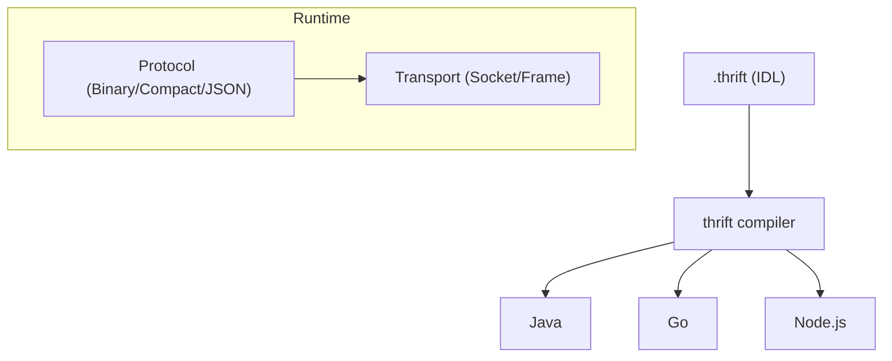

# Apache Thrift

## Qué es

Framework de serialización y RPC multi-lenguaje, desarrollado originalmente por Facebook (2007) y donado a Apache Software Foundation. Define un IDL propio para describir tipos y servicios, y genera código para múltiples lenguajes.

- **Licencia:** Apache 2.0
- **Creador:** Facebook (Meta) / Apache Software Foundation
- **Formato:** Binario (múltiples protocolos)
- **Schema:** Obligatorio (`.thrift`)

## Conceptos clave

- **IDL (Interface Definition Language):** Lenguaje propio para definir tipos (`struct`, `enum`, `union`, `exception`) y servicios RPC.
- **Protocolos de serialización:** Thrift soporta múltiples formatos internos:
  - **TBinaryProtocol:** Codificación binaria directa.
  - **TCompactProtocol:** Codificación compacta (similar a varint de Protobuf).
  - **TJSONProtocol:** Codificación JSON legible.
- **Transports:** Capa de transporte abstraída (`TSocket`, `TFramedTransport`, `TBufferedTransport`).
- **Code generation:** El compilador `thrift` genera código para 20+ lenguajes.
- **Namespaces:** Paquetes/namespaces por lenguaje en el mismo archivo `.thrift`.
- **Versionado:** Campos opcionales (`optional`) y field IDs para schema evolution.

## Arquitectura



## Instalación

```bash
# Ubuntu/Debian
sudo apt install thrift-compiler

# Verificar
thrift --version

# Generar código
thrift --gen java message.thrift
thrift --gen go message.thrift
```

## Uso en serialplab

Thrift es uno de los 7 protocolos de serialización evaluados. Se usa solo como formato de serialización (no como framework RPC). Los schemas se ubican en `schemas/thrift/`.

- [spec thrift](../../specs/protocols/thrift.md)

## Referencias

- [Apache Thrift](https://thrift.apache.org/)
- [Thrift IDL](https://thrift.apache.org/docs/idl)
- [Thrift Types](https://thrift.apache.org/docs/types)
